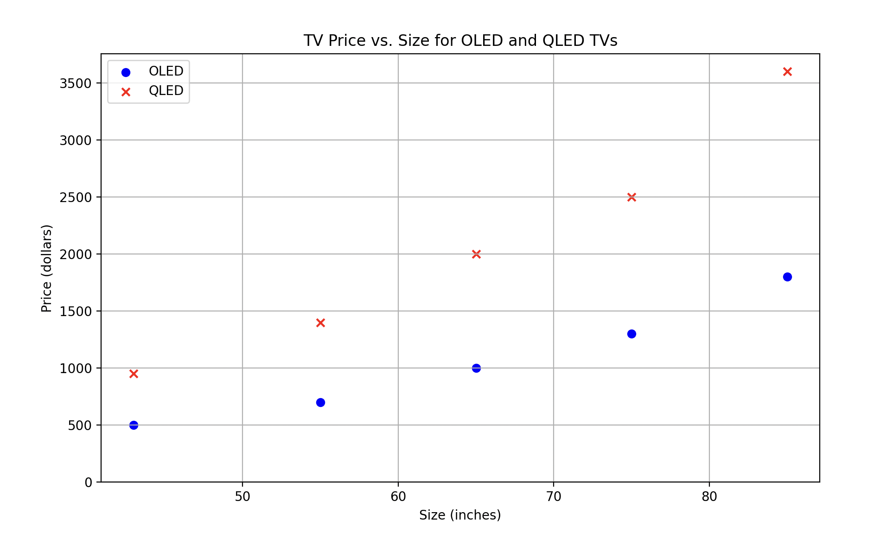

# Generate Synthetic Data

In this cookbook recipe, we go over how to generate synthetic data for LLMs, in this case, OpenAI’s `gpt-4o-mini`. When using LLMs to synthetically generate data, it is most useful to generate non-numerical data which isn’t strictly dependent on a defined probability distribution - in those cases, it will be far easier to define a distribution and generate these points directly from the distribution.

However, for:

- data that needs general intelligence to be realistic
- data that lists many items within a broad category
- data which is language related

and more, LLMs are far easier to use and yield better (or the only feasible) results.

??? tip "Mirascope Concepts Used"

    - [Prompts](../learn/prompts.md)
    - [Calls](../learn/calls.md)
    - [Response Models](../learn/response_models.md)

!!! note "Background"

    Large Language Models (LLMs) have emerged as powerful tools for generating synthetic data, particularly for text-based applications. Compared to traditional synthetic data generation methods, LLMs can produce more diverse, contextually rich, and human-like textual data, often with less need for domain-specific rules or statistical modeling.
    
## Generate Data as CSV

To generate realistic, synthetic data as a csv, you can accomplish this in a single call by requesting a csv format in the prompt and describing the kind of data you would like generated.

```python
--8<-- "examples/cookbook/generating_synthetic_data.py:7:41"
```

Note that the prices and inventory of each item are somewhat realistic for their corresponding item, something which would be otherwise difficult to accomplish.

## Generate Data with `response_model`

Sometimes, it will be easier to integrate your datapoints into your code if they are defined as some schema, namely a Pydantic `BaseModel`. In this case, describe each column as the `description` of a `Field` in the `BaseModel` instead of the prompt, and set `response_model` to your defined schema:

```python
--8<-- "examples/cookbook/generating_synthetic_data.py:5:6"
--8<-- "examples/cookbook/generating_synthetic_data.py:42:70"
```

## Generate Data into a pandas `DataFrame`

Since pandas is a common library for working with data, it’s also worth knowing how to directly create and append to a dataframe with LLMs.

### Create a New `DataFrame`

To create a new `DataFrame`, we define a `BaseModel` schema with a simple function to generate  `DataFrame` via a list of list of data and the column names:

```python
--8<-- "examples/cookbook/generating_synthetic_data.py:1:4"

--8<-- "examples/cookbook/generating_synthetic_data.py:72:115"
```

### Appending to a `DataFrame`

To append to a `DataFrame`, we can modify the prompt so that instead of describing the data we want to generate, we ask the LLM to match the type of data it already sees. Furthermore, we add a `append_dataframe()` function to append to an existing `DataFrame`. Finally, note that we use the generated `df` from above as the `DataFrame` to append to in the following example:

```python
--8<-- "examples/cookbook/generating_synthetic_data.py:131:148"
```

## Adding Constraints

While you cannot successfully add complex mathematical constraints to generated data (think statistics, such as distributions and covariances), asking LLMs to abide by basic constraints will (generally) prove successful, especially with newer models. Let’s look at an example where we generate TVs where the TV price should roughly linearly correlate with TV size, and QLEDs are 2-3x more expensive than OLEDs of the same size:

```python
--8<-- "examples/cookbook/generating_synthetic_data.py:1:2"
--8<-- "examples/cookbook/generating_synthetic_data.py:148:183"
```

To demonstrate the constraints’ being followed, you can graph the data using matplotlib, which shows the linear relationships between size and price, and QLEDs costing roughly twice as much as OLED:



!!! tip "Additional Real-World Examples"
    - **Healthcare and Medical Research**: Generating synthetic patient records for training machine learning models without compromising patient privacy
    - **Environmental Science**: Generating synthetic climate data for modeling long-term environmental changes
    - **Fraud Detection Systems**: Generating synthetic data of fraudulent and legitimate transactions for training fraud detection models.

When adapting this recipe to your specific use-case, consider the following:
    - Add Pydantic `AfterValidators` to constrain your synthetic data generation
    - Verify that the synthetic data generated actually matches real-world data.
    - Make sure no biases are present in the generated data, this can be prompt engineered.
    - Experiment with different model providers and versions for quality.
