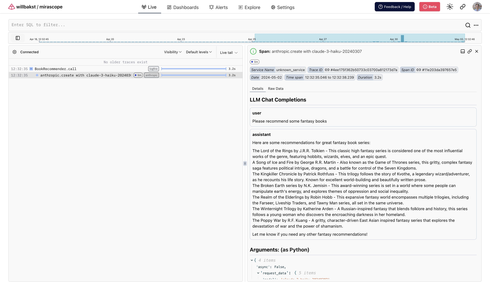

# Logfire

[Logfire](https://docs.pydantic.dev/logfire/), a new tool from Pydantic, is built on OpenTelemetry. As Mirascope is also built on Pydantic, it's appropriate for us to ensure seamless integration with them.

## How to use Logfire with Mirascope

```python
from mirascope.logfire import with_logfire
```

`with_logfire` is a decorator that can be used on all Mirascope classes to automatically log both Mirascope calls and also all our [supported LLM providers](../concepts/supported_llm_providers.md).

## Examples

### Call

This is a basic call example but will work with all our call functions, `call`, `stream`, `call_async`, `stream_async`.

```py hl_lines="1 2 5 8"
import logfire
from mirascope.logfire import with_logfire
from mirascope.anthropic import AnthropicCall

logfire.configure()


@with_logfire
class BookRecommender(AnthropicCall):
    prompt_template = "Please recommend some {genre} books"

    genre: str


recommender = BookRecommender(genre="fantasy")
response = recommender.call()  # this will automatically get logged with logfire
print(response.content)
#> Here are some recommendations for great fantasy book series: ...
```

This will give you:

* A span around the `AnthropicCall.call()` that captures items like the prompt template, templating properties and fields, and input/output attributes
* Human-readable display of the conversation with the agent
* Details of the response, including the number of tokens used



### Extract

Since Mirascope is built on top of [Pydantic](https://docs.pydantic.dev/latest/), you can use the [Pydantic plugin](https://docs.pydantic.dev/latest/concepts/plugins/) to track additional logs and metrics about model validation, which you can enable using the [`pydantic_plugin`](https://docs.pydantic.dev/logfire/integrations/pydantic/) configuration.

This can be particularly useful when [extracting structured information](../concepts/extracting_structured_information_using_llms.md) using LLMs:

```py hl_lines="3 4 8 17"
from typing import Literal, Type

import logfire
from mirascope.logfire import with_logfire
from mirascope.openai import OpenAIExtractor
from pydantic import BaseModel

logfire.configure(pydantic_plugin=logfire.PydanticPlugin(record="all"))


class TaskDetails(BaseModel):
    description: str
    due_date: str
    priority: Literal["low", "normal", "high"]


@with_logfire
class TaskExtractor(OpenAIExtractor[TaskDetails]):
    extract_schema: Type[TaskDetails] = TaskDetails
    prompt_template = """
    Extract the task details from the following task:
    {task}
    """

    task: str


task = "Submit quarterly report by next Friday. Task is high priority."
task_details = TaskExtractor(
    task=task
).extract()  # this will be logged automatically with logfire
assert isinstance(task_details, TaskDetails)
print(task_details)
#> description='Submit quarterly report' due_date='next Friday' priority='high'
```

This will give you:

* Tracking for validation of Pydantic models
* A span around the `OpenAIExtractor.extract()` that captures items like the prompt template, templating properties and fields, and input/output attributes
* Human-readable display of the conversation with the agent including the function call
* Details of the response, including the number of tokens used


### FastAPI

You can take advantage of existing `instruments` from logfire and integrate it with Mirascope.

```python
import os
from typing import Type

import logfire
from fastapi import FastAPI
from pydantic import BaseModel

from mirascope.logfire import with_logfire
from mirascope.openai import OpenAIExtractor

os.environ["OPENAI_API_KEY"] = "YOUR_OPENAI_API_KEY"

app = FastAPI()
logfire.configure()
logfire.instrument_fastapi(app)


class Book(BaseModel):
    title: str
    author: str


@with_logfire
class BookRecommender(OpenAIExtractor[Book]):
    extract_schema: Type[Book] = Book
    prompt_template = "Please recommend a {genre} book."

    genre: str


@app.post("/")
def root(book_recommender: BookRecommender) -> Book:
    """Generates a book based on provided `genre`."""
    return book_recommender.extract()
```

This will generate a well-structured hierarchy. This way, you can view your API calls, Mirascope models, and LLM calls all in one place with just a few lines of code.


### RAG

```python
from mirascope.chroma import ChromaSettings, ChromaVectorStore
from mirascope.logfire import with_logfire
from mirascope.openai import OpenAIEmbedder
from mirascope.rag import TextChunker

@with_logfire
class MyStore(ChromaVectorStore):
    embedder = OpenAIEmbedder()
    chunker = TextChunker(chunk_size=1000, chunk_overlap=200)
    index_name = "wikipedia-0001"
    client_settings = ChromaSettings()

store = MyStore()
store.add("some data") # this will automatically get logged with logfire
```

### Integrations with other providers

At present, Logfire includes `instrument_openai` and `instrument_fastapi`. As the Logfire team introduces more `instruments`, the Mirascope team will also update `with_logfire` to incorporate these instruments. Meanwhile, Mirascope ensures Logfire integration with all of its providers. Here is an example using Anthropic:

```python
import logfire

from mirascope.anthropic import AnthropicCall
from mirascope.logfire import with_logfire

logfire.configure()

@with_logfire
class BookRecommender(AnthropicCall):
    prompt_template = "Please recommend some {genre} books"

    genre: str

recommender = BookRecommender(genre="fantasy")
response = recommender.call()  # this will automatically get logged with logfire
print(response.content)
```
