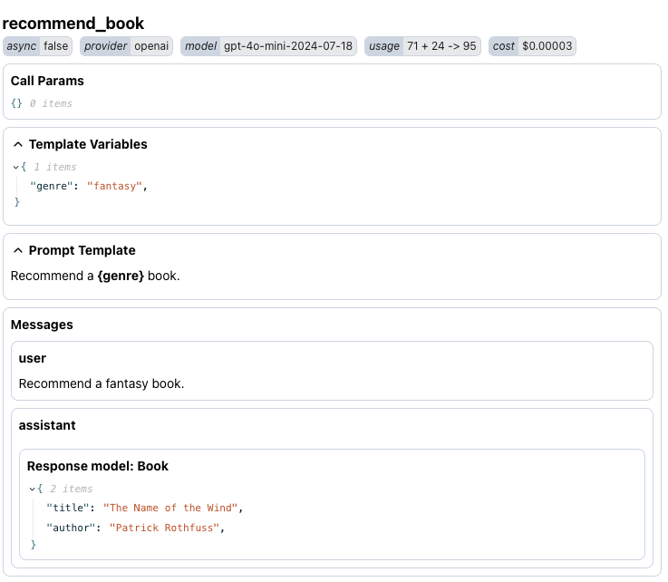

# Logfire

[Logfire](https://docs.pydantic.dev/logfire/), a new tool from Pydantic, is built on OpenTelemetry. As Mirascope is also built on Pydantic, it's appropriate for us to ensure seamless integration with them.

## How to use Logfire with Mirascope

```python
pip install logfire

from mirascope.integrations.logfire import with_logfire
```

`with_logfire` is a decorator that can be used on all Mirascope classes to automatically log both Mirascope calls and also all our [supported LLM providers](https://docs.mirascope.io/latest/SUPPORTED_PROVIDERS/).

## Examples

### Call

A Mirascope call:

```python
import logfire

from mirascope.core import anthropic, prompt_template
from mirascope.integrations.logfire import with_logfire

logfire.configure()

def format_book(title: str, author: str):
    return f"{title} by {author}"

@with_logfire
@anthropic.call(model="claude-3-5-sonnet-20240620", tools=[format_book])
@prompt_template("""Recommend a {genre} book.""")
def recommend_book(genre: str): ...

recommend_book("fantasy")
```

This will give you:

* A span called `recommend_book` that captures items like the prompt template, templating properties and fields, and input/output attributes
* Human-readable display of the conversation with the agent
* Details of the response, including the number of tokens used


### Stream

Streaming a Mirascope call:

```python
import logfire

from mirascope.core import openai, prompt_template
from mirascope.integrations.logfire import with_logfire

logfire.configure()

@with_logfire
@openai.call(
    model="gpt-4o-mini",
    stream=True,
    call_params={"stream_options": {"include_usage": True}},
)
@prompt_template("""Recommend a {genre} book.""")
def recommend_book(genre: str): ...


for chunk, _ in recommend_book("fantasy"):
    print(chunk.content, end="", flush=True)
```

For some providers, certain `call_params` will need to be set in order for usage to be tracked.
Also note that the span will not be logged until the stream has been exhausted.

### Response Model

Since Mirascope `response_model` is built on top of [Pydantic](https://docs.pydantic.dev/latest/), you can use the [Pydantic Plugin](https://docs.pydantic.dev/latest/concepts/plugins/) to track additional logs and metrics about model validation, which you can enable using the pydantic_plugin configuration.

This can be particularly useful when [extracting structured information using LLMs](https://docs.mirascope.io/latest/learn/response_models/):

```python
import logfire
from pydantic import BaseModel

from mirascope.core import openai, prompt_template
from mirascope.integrations.logfire import with_logfire

logfire.configure(pydantic_plugin=logfire.PydanticPlugin(record="all"))

class Book(BaseModel):
    title: str
    author: str


@with_logfire
@openai.call(model="gpt-4o-mini", response_model=Book)
@prompt_template("""Recommend a {genre} book.""")
def recommend_book(genre: str): ...

recommend_book("fantasy")
```

This will give you:

* Tracking for validation of Pydantic models
* All the information from call with a `response_model` output.



You can also set `stream=True` with the same rules as streaming a call. Note that the Pydantic Plugin will log many times if you are streaming a `response_model`, so it is recommended to wrap the Mirascope call in a function.

## FastAPI

You can take advantage of existing instruments from Logfire and integrate it with Mirascope.

```python
import logfire
from fastapi import FastAPI
from pydantic import BaseModel

from mirascope.core import openai, prompt_template
from mirascope.integrations.logfire import with_logfire

app = FastAPI()
logfire.configure()
logfire.instrument_fastapi(app)

class Book(BaseModel):
    title: str
    author: str


@app.post("/")
@with_logfire
@openai.call(model="gpt-4o-mini", response_model=Book)
@prompt_template("""Recommend a {genre} book.""")
def recommend_book(genre: str): ...
```

## Instrumenting LLM Providers directly

If you choose not to use our `with_logfire` decorator, you can manually instrument the client using Logfire instruments.

Here is an example Mirascope call using `logfire.instrument_openai`:

```python
import logfire
from openai import Client

from mirascope.core import openai, prompt_template

client = Client()
logfire.configure()
logfire.instrument_openai(client)

@openai.call(model="gpt-4o-mini", client=client)
@prompt_template("""Recommend a {genre} book.""")
def recommend_book(genre: str): ...


recommend_book("fantasy")
```
